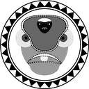
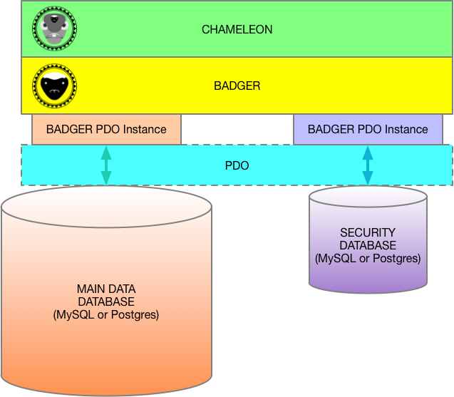

\page CHAMELEON CHAMELEON

CHAMELEON
======

Part of the BAOBAB Server, which is part of the Rift Valley Platform
--------------------------------------------------------------------

INTRODUCTION
============
CHAMELEON is a "first-layer" extension of \ref BADGER.

While BADGER provides a low-level interface and abstraction to the databases, CHAMELEON starts to put these abtractions to work.

\ref BADGER is the "First Layer Connection" to the data storage subsystem. It uses [PHP PDO](http://php.net/manual/en/book.pdo.php) to abstract from the databases, and provide SQL-injection protection through the use of [PHP PDO Prepared Statements](http://php.net/manual/en/pdo.prepared-statements.php).

COLLECTIONS
-----------

CHAMELEON introduces the `CO_Collection` class (and some similar ones, all based on the `tCO_Collection` trait) that provide for a hierarchy. The collection classes can aggregate other instances (including other collections).

Because collections are implemented using [PHP traits](http://php.net/manual/en/language.oop5.traits.php), they are more like a "mixin" class, than a straight hierarchy. Keep this in mind if you will be deriving from them.

OWNER
-----

The database has the concept of object "owners." These are IDs (numerical), assigned to the "owner" column in the data database rows. The "owner" is another row (of the ID referenced). The relationship is extremely simple, and is really meant as a "triage" for large datasets.

PLACES
------

CHAMELEON has a specialization of the `CO_LL_Location` class (`CO_Place`), where it adds address elements (and the ability to have Google Geocoding/Reverse Geocoding applied). It further extends that for the United States, with `CO_US_Place`.

KEY/VALUE PAIR STORAGE
----------------------

CHAMELEON introduces the KEY/VALUE (sometimes known as DICTIONARY) pattern for storing arbitrary data (the `CO_KeyValue` class). The data can be quite large, as its stored in the payload column. The key needs to be unique within the database, but the access_class of the row is also figured into the calculation, so you have a bit of flexibility.

IMPLEMENTATION
==============

You implement CHAMELEON by setting up a pair of databases, and reference them via the `CO_Config` static class, then instantiate `CO_Chameleon`.

EXTENDING CHAMELEON
===================

If you will extend a class, you should keep the base class name (after the `"CO_"`), because we can do a wildcard lookup to get hierarchies.

`CO_Place`, `CO_KeyValue` and `CO_Collection` / `CO_Place_Collection` / `CO_US_Place_Collection` are all designed to be extended, so a UK place might be `"CO_UK_Place"`.

LICENSE
=======

© Copyright 2018, Little Green Viper Software Development LLC/The Great Rift Valley Software Company

LICENSE:

MIT License

Permission is hereby granted, free of charge, to any person obtaining a copy of this software and associated documentation
files (the "Software"), to deal in the Software without restriction, including without limitation the rights to use, copy,
modify, merge, publish, distribute, sublicense, and/or sell copies of the Software, and to permit persons to whom the
Software is furnished to do so, subject to the following conditions:

The above copyright notice and this permission notice shall be included in all copies or substantial portions of the Software.

THE SOFTWARE IS PROVIDED "AS IS", WITHOUT WARRANTY OF ANY KIND, EXPRESS OR IMPLIED, INCLUDING BUT NOT LIMITED TO THE WARRANTIES
OF MERCHANTABILITY, FITNESS FOR A PARTICULAR PURPOSE AND NONINFRINGEMENT.
IN NO EVENT SHALL THE AUTHORS OR COPYRIGHT HOLDERS BE LIABLE FOR ANY CLAIM, DAMAGES OR OTHER LIABILITY, WHETHER IN AN ACTION OF
CONTRACT, TORT OR OTHERWISE, ARISING FROM, OUT OF OR IN CONNECTION WITH THE SOFTWARE OR THE USE OR OTHER DEALINGS IN THE SOFTWARE.

Little Green Viper Software Development: https://littlegreenviper.com
The Great Rift Valley Software Company: https://riftvalleysoftware.com
